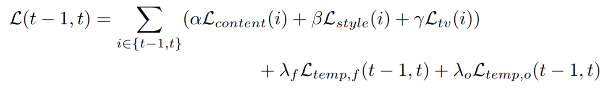

# ReCoNet-PyTorch
This repository contains a PyTorch implementation of the [ReCoNet paper](https://arxiv.org/pdf/1807.01197.pdf). This is the course project for CS763, IITB.

### Contributors:
- [Mohd Safwan](https://github.com/safwankdb)
- [Kushagra Juneja](https://github.com/kushagra1729)
- [Saksham Khandelwal](https://github.com/skq024)

### Abstract
We aim to build a generalisable neural style transfer network for videos with temporal consistency and efficient real time style transfer using any modern GPU. All the past techniques haven't been able to accomplish real-time efficient style transfer either lacking in temporal consistency, nice perceptual style quality or fast processing. Here we have used ReCoNet, which tried to mitigate all these problems.

### ReCoNet
ReCoNet is a feed forward neural network, which stylises videos frame by frame through an encoder and subsequently a decoder, and a VGG loss network to capture the perceptual style of the transfer target. The temporal loss is guided by occlusion masks and optical flow. Only the encoder and decoder run during inference which makes ReCoNet very efficient, running above real-time (~200fps) on modern GPUs.<br>
The network is illustrated in the figure below:<br>


### Dataset
We have used MPI Sintel dataset which contains around 1000 frames and FlyingChairs dataset which contains about 22000 frames as the training datasets and a video clipping of some animated movie for testing.<br>
We have tried style transfer over the following styles:<br>
<div align='center'>
  
  
  
  
</div>

### Loss functions and optimisation
The network consists of a multi level temporal loss which focuses on temporal coherence at both high level feature maps and the final stylised output. The high level features do not involve the effect of luminance and hence, whereas the finalised output has a luminance term included. The perceptual losses are calculated using the VGG 16 network, and involve the content loss, style loss and the total variation regularizer. They are calculated on each frame separately and then summed up with the temporal losses for the particular frame.<br>
The final loss function is:<br>
 <div align='center'>
   
</div>

### Requirements
```bash
numpy
Pillow
scikit-image
opencv-python
torch
torchvision
```
### References
[1] Real Time Coherent Video Style Transfer Network : https://arxiv.org/pdf/1807.01197.pdf <br>
[2] Gram matrix : https://pytorch.org/tutorials/advanced/neural_style_tutorial.html <br>
[3] ReCoNet Model : https://github.com/irsisyphus/reconet/blob/master/network.py <br>
[4] Optical flow warping : https://github.com/NVlabs/PWC-Net/blob/master/PyTorch/models/PWCNet.py<br>
[5] Optical flow I/O : https://lmb.informatik.uni-freiburg.de/resources/datasets/SceneFlowDatasets.en.html
